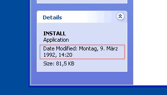
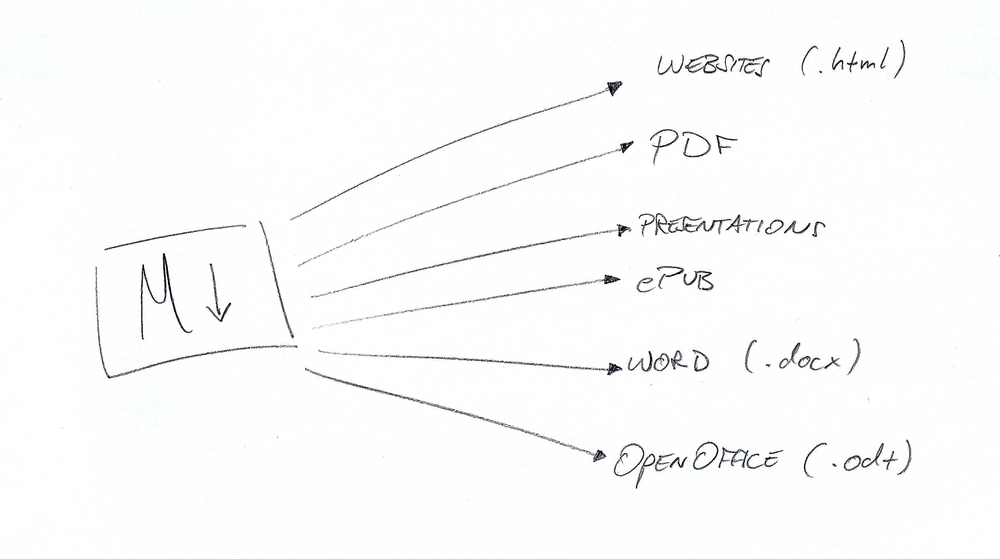

# Why I use plain text and you should do as well

!SLIDE fancy

# Why I use plain text...

... and you should do as well!

[Sebastian Christ](http://macrudy.com) | [@rudolfo_christ](https://twitter.com/rudolfo_christ)

!SLIDE fancy main

## What is plain text?

!SLIDE fancy main

## What is plain text?

```markdown

  This is plain text.
  No styling. No formatting.
  Just characters....

```

!SLIDE fancy

## What about word processors?

!NOTE

- Separation of Concerns
- no formatting or styling that distracts from writing

!SLIDE fancy 

## No vendor lock-in



!NOTE

- since Oct 6, 1960. Start of the ASCII table
- it will be there the next 50 years
- available on every platform

!SLIDE fancy

## What about PDF?

!NOTE 

- introduce Markdown

!SLIDE fancy

## Markdown


!SLIDE fancy

## Markdown

```markdown

  # This is a headline

  You can write paragraph text 
  without any special syntax or formatting.

  - Lists
  - are
  - simple like this

  Add links if you [want](http://www.google.com)

```

!NOTE

- markdown is just enough formatting to not distract you

!SLIDE fancy 

## Write once use everywhere



!SLIDE fancy

## Questions?

!SLIDE fancy

## Thank you

Credits:

- Daring Fireball: [Markdown](http://daringfireball.net/projects/markdown/)
- Slides generated with [Keydown](https://github.com/infews/keydown)

[](http://creativecommons.org/licenses/by-sa/3.0/de/deed.en_US)
